# Developing an IoT system with IBM Cloud

This article walks through different components involved in a typical IoT system while implementing a simple IoT project. We'll cover some important aspects of an IoT system like architecture-design, analytics, security, and device management.

**Prerequisites**: The code snippets assume familiarity with Python and a basic understanding of network protocols. 

## About the project 

The IoT project that we'll attempt to build is a Door Monitoring System. The post will be more oriented towards architecture and design, and to minimize fiddling with hardware, pins, and wires, we'll use a smartphone device as a proxy for the collection of discrete hardware sensors. I'll use my old Android phone during development, which consists of Accelerometer, Proximity Sensor, and light intensity sensor. Most smartphones (even the quite old ones) will have these basic sensors. That's why a real smartphone will serve as a good alternative for actual sensors. 

Our Door Monitoring System comprises of the sensor (smartphone) attached to the doors, which will keep recording different parameters value. These values can be used to trigger different actions, and the collected data can be used to perform analytics.

## The IoT architecture

A simple IoT architecture can be seen as the one consisting of two layers, the device, and the cloud. The devices are connected directly through the cloud via the network. The cloud orchestrates the devices and uses their data for analytics, monitoring, etc. This structure can work for simplistic use-cases, but as the system scales, we might have to add more complexity.

**Complexities of an IoT system:** A typical IoT solution involves many heterogeneous IoT devices, with sensors that produce data in different formats at different rates, which is then processed and analyzed to gain insights. IoT devices can be connected either directly to a network or through a gateway device to a network, which enables the devices to communicate with each other and with cloud services and applications. The devices can be geographically separated and may transmit information over any of the wireless protocols like [Bluetooth](https://www.bluetooth.com/), [Zigbee](https://zigbeealliance.org/), [WiFi](https://www.wi-fi.org/), [Cellular](https://en.wikipedia.org/wiki/Cellular_network), [RFID](https://en.wikipedia.org/wiki/Radio-frequency_identification) or over wired protocols like [Ethernet](https://en.wikipedia.org/wiki/Ethernet). 

So it helps to add a layer between devices and cloud where these heterogeneous protocols and data-formats can be aggregated before sending them to the cloud. This layer can be called Gateway or Edge layer, and it could be integrated into your router or on another dedicated device altogether. Apart from aggregation, the Gateway / Edge layer can serve the following purposes,
- Device provisioning: Since the gateway is the first point-of-contact for a device, it can be used to provision and register new devices to the network.
- Edge computing: Not all of the data generated by the devices might be useful for our IoT system. So the gateways can be used to pre-process or filter some of the data before sending it to the cloud. This helps in preventing unnecessary load at the cloud and makes the system much more bandwidth and resource-efficient.
- Virtual abstraction for devices: The cloud layer can rely on the edge for communicating for the devices. Since the devices might have intermittent connectivity, the edge can provide the last known status of the device to the cloud and store the commands sent to the device from the above layers if the device is not reachable. These commands can be sent to the device once it's back online.

This three-layered architecture can be extended further by dividing roles and responsibilities into different services. For example, this [IoT reference architecture]( https://www.ibm.com/cloud/architecture/architectures/iotArchitecture/reference-architecture ) below by IBM adds Enterprise and User layers into the architecture and depicts various components (services) of each layer. The key thing to note in designing an architecture is that a particular layer/service needs to only engage with those immediately connected to it.

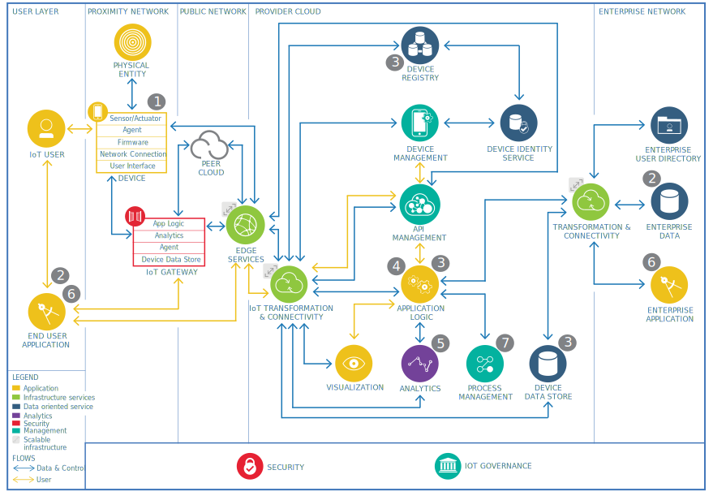


### The architecture of our application

We'll be using a single smartphone device in our project implementation. But we'd like to design the system in a way that's easy to scale to multiple devices and touch on different concepts like security, device management, and analytics. We'll add another device to the system to represent the gateway layer. I have a spare raspberry-pi that supports wifi which I'll use as a gateway. You can also use a different micro-controller or even your PC to run the code related to the gateway. We'll be leveraging IBM cloud's IoT platform and other services to avoid reinventing the wheel for things like security, device-management, monitoring, analytics and visualizations.

## The IoT protocols

As mentioned earlier, in an IoT system there may be heterogeneous devices using different protocols to communicate with the gateway. The most prevalent protocol however, in the IoT world is MQTT (MQ Telemetry Transport). The "MQ" in "MQTT" comes from IBM's [MQ](https://www.ibm.com/in-en/products/mq) product line. 

MQTT is a machine to machine messaging protocol. It is designed to be lightweight and fast, keeping in mind the power and resource constraints of a typical IoT device. The protocol runs over TCP-IP and operates on the publish-subscribe model. The key entities in a functional MQTT system are,

- MQTT client
- Message broker
- Topics and messages

The clients communicate with the broker (not directly with each other), where they can publish messages or subscribe to hierarchical message topics. Topics are used to segregate different data. You can read more about how MQTT works in the [Getting to know MQTT](https://developer.ibm.com/articles/iot-mqtt-why-good-for-iot/) article.

MQTT is not the only protocol; there are other communication protocols as well like [ XMPP](https://en.wikipedia.org/wiki/XMPP) (an XML-based chat protocol),[ CoAP](https://tools.ietf.org/html/rfc7252) (Constrained Application Protocol), web-sockets, or higher-level device-management oriented protocols like LMW2M, OMA-DM, and TR-069.

### Protocols for our Application

We'll be using MQTT for communicating data from our gateway (raspberry-pi) to the broker in the IBM IoT cloud and vice-versa. The IBM Cloud's IoT platform operates over MQTT and provides a lot of useful functionalities out of the box. 

For communicating data from the smartphone, we have multiple options. We can use Bluetooth, MQTT, web-sockets, or HTTP. Based on the protocol we choose, we'll have to implement appropriate listening logic at the gateway. Typically, one might go after building a custom mobile application or a website that can access sensor data and other device details. But since our use-case is simple (relaying the sensor data), we can use any of the existing applications like [Senor Node](https://play.google.com/store/apps/details?id=com.mscino.sensornode&hl=en_IN) (uses MQTT), [SensorUDP](https://play.google.com/store/apps/details?id=com.ubccapstone.sensorUDP&hl=en_IN) (uses sockets) or [SensorStreamer](https://play.google.com/store/apps/details?id=cz.honzamrazek.sensorstreamer&hl=en_IN) (uses HTTP) or a custom webpage leveraging [Sensor APsI](https://developer.mozilla.org/en-US/docs/Web/API/Sensor_APIs) like [this](https://sensor-js.xyz/demo.html) to access device's sensor readings. 

As we'll be covering MQTT protocol for the gateway to cloud communication, and HTTP is un-necessary overhead for continuous telemetry data, let's pick [SensorUDP](https://play.google.com/store/apps/details?id=com.ubccapstone.sensorUDP&hl=en_IN) to stream the sensor data for this post.

Having decided the high-level specifics of the project, let's now move to the implementation part,

## Implementation

### 1. Create an IoT Service at IBM cloud

Log in to [IBM Cloud](https://cloud.ibm.com/). To instantiate a new IoT Platform service, open the [Catalog](https://cloud.ibm.com/catalog) from within the IBM Cloud dashboard and select the ‘Internet of Things’ from the sidebar on the right-hand side of the screen and then select ‘Internet of Things Platform’. Enter a  service name, select a region and plan, and then press the **Create** button to create the service.

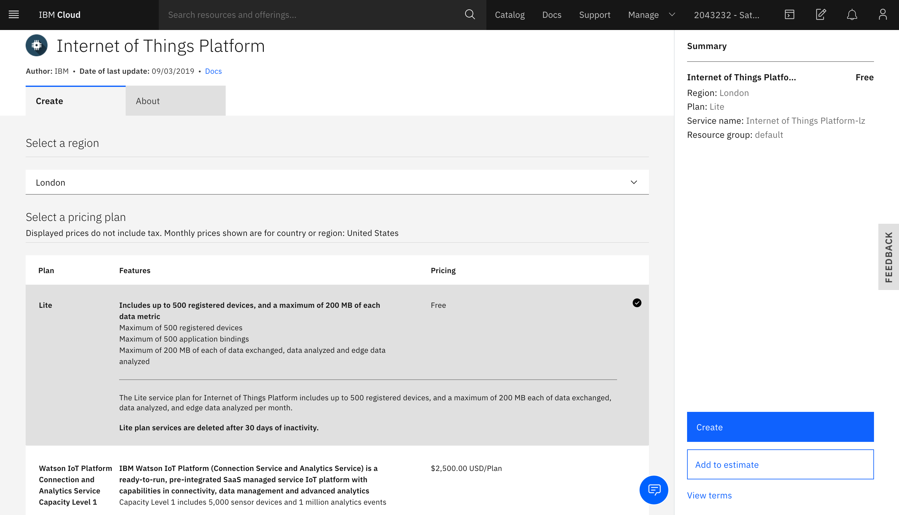

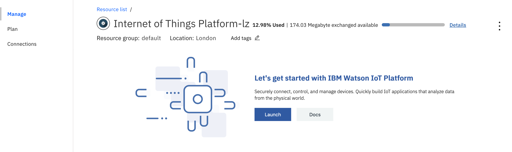

 Once done, click on Launch, and you'll see a dashboard similar to below.

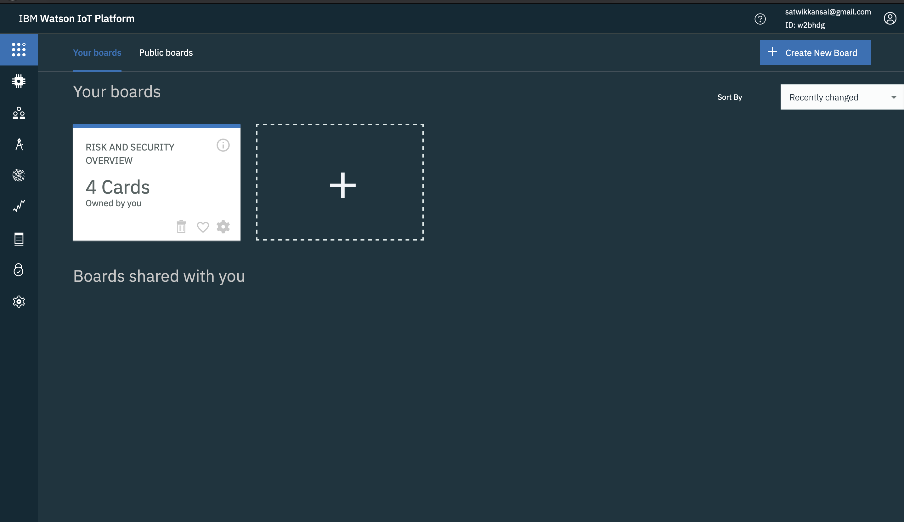

### 2. Create a new Gateway device type and register the gateway device.

As mentioned before, we'll be using a raspberry-pi as a gateway between the devices and the cloud service. We'll have to create a new Gateway device Type and then register it in our IoT service. To register the device type and then device, you can follow the steps in the “[How to Register Gateways in IBM Watson IoT Platform](https://developer.ibm.com/recipes/tutorials/how-to-register-gateways-in-ibm-watson-iot-platform/)” recipe. You can provide device information and meta-data while registering if you like. 


 I'll leave the (optional) device information empty and fill some of it when I register the gateway device next.

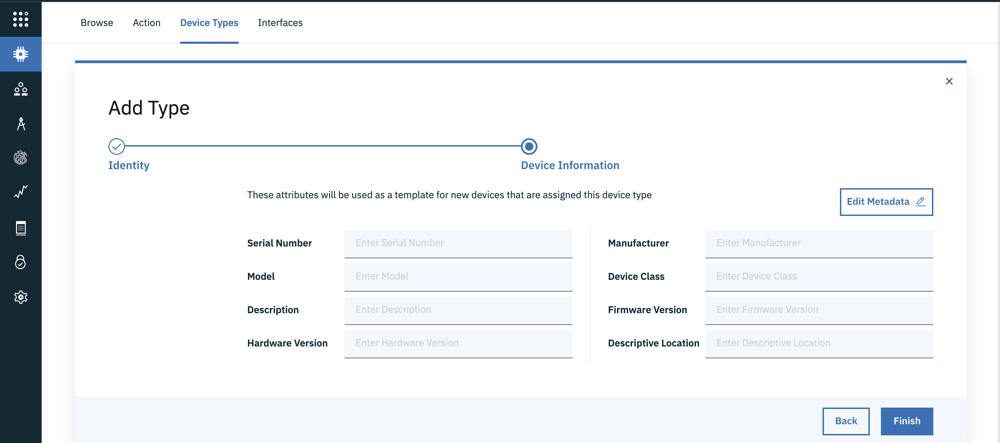


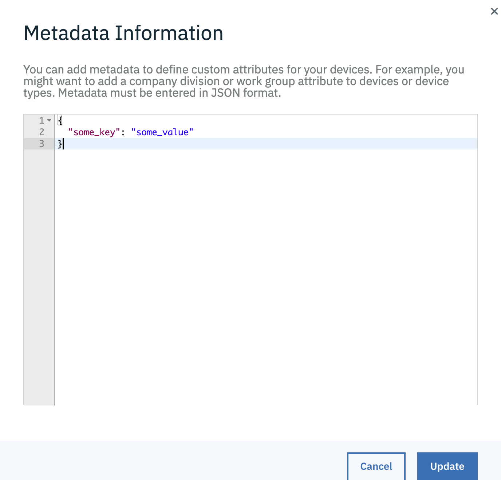

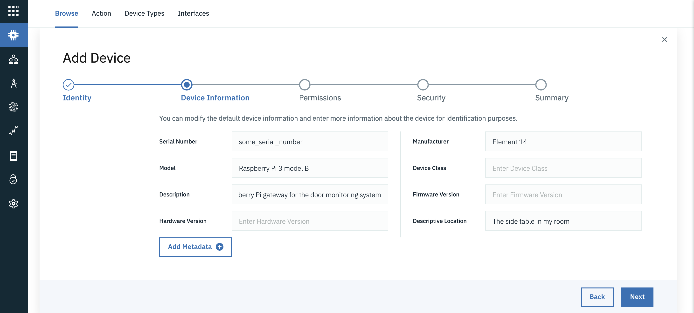

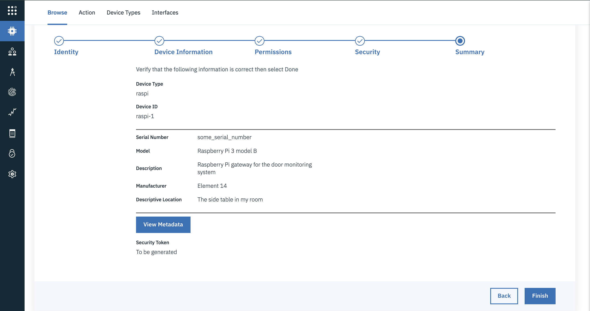

Copy the device credentials as you'll not be able to see them again, and we'll be needing them later on. 


We've created a gateway type called "raspi" and registered a gateway device with ID "raspi-1". By default, the gateway devices are registered with a privileged permission role that gives them the authority to add devices to the Platform Service (more on this later).

### 3. Create a Device type for the smartphone

We'll need to create a Device type (remember that a Gateway type is different from a Device type) for our smartphone. You can follow the steps in the “[How to Register Devices in IBM Watson IoT Platform](https://developer.ibm.com/recipes/tutorials/how-to-register-devices-in-ibm-iot-foundation/)” recipe. Since we'll be using a device running Android, I'll just set the device type name as "Android", but you can choose to name it whatever you like. 


**Note:** We don't need to register our smartphone device (just like we registered our raspi-1) for now. As you'll see later, we'll use the privileged gateway to register the smartphone programmatically.

### 4. Configure and connect the gateway to the cloud

The gateway device will be communicating with the cloud via the MQTT protocol. To configure the connection to MQTT broker in IBM IoT cloud, we'll need the following pieces of information (which we copied while registering 'raspi-1') 

- Organization ID (the 6-character identifier)
- Device Type (in our case, raspi)
- Device ID for the specific device (for example, I used raspi-1)
- Authentication Token

For security, we should use TLS to connect to the MQTT broker. We need a host address, client ID, username, and password to initiate an MQTT connection to the broker. The host address to which we need to connect is of the form `<orgid>.messaging.internetofthings.ibmcloud.com`, the clientId is of the form `"d:<orgid>:<device_type>:<device_id>"`, and the user is `use‑token‑auth` if you're using a token for authentication, and the password is the value of the authentication token itself. 

We can use a library like [paho-mqtt](https://pypi.org/project/paho-mqtt/) to set-up the connection, but it might take some effort to configure things correctly. Fortunately, IBM provides a [Python SDK](https://pypi.org/project/wiotp-sdk/) (which internally uses paho-mqtt) that will make development much easier for us throughout the post. Following is how you can connect as a gateway client to the MQTT broker in the IBM IoT platform using the wiotp-sdk,

```sh
# Installing the pypi package
$ pip install wiotp-sdk 
```

```python
# File gateway_client.py

import wiotp.sdk.gateway

def get_gateway_cilent(config_file_path):
    config = wiotp.sdk.gateway.parseConfigFile(config_file_path)
    client = wiotp.sdk.gateway.GatewayClient(config=config, logHandlers=None)
    return client

client = get_gateway_cilent('gateway_config.yml')
```

The `get_gateway_cilent` takes path to yaml config file, where you can specify all the above mentioned configurations. The file looks something like this,

```yaml
# File gateway_config.yml
identity:
    orgId: 65cjsf
    typeId: raspi
    deviceId: raspi-2
auth:
    token: your_auth_token_here
options:
    domain: internetofthings.ibmcloud.com
    logLevel: debug
    mqtt:
        port: 8883
        transport: tcp
```

We can call the `connect` method to initiate the connection, if the logLevel is set to `debug` in the configuration file, you'll see an output similar to below,

```python
client.connect() # Initiating the connection
```

```
# The debug output
2020-03-03 22:38:46,897   wiotp.sdk.gateway.client.GatewayClient  DEBUG   Connecting... (address = 65cjsf.messaging.internetofthings.ibmcloud.com, port = 8883, clientId = g:65cjsf:raspi:raspi-1, username = use-token-auth)
2020-03-03 22:38:46,897   wiotp.sdk.gateway.client.GatewayClient  DEBUG   Connecting with clientId g:65cjsf:raspi:raspi-1 to host 65cjsf.messaging.internetofthings.ibmcloud.com on port 8883 with keepAlive set to 60
2020-03-03 22:38:46,898   wiotp.sdk.gateway.client.GatewayClient  DEBUG   User-Agent: MQTT/3.1.1 (Darwin 19.2.0) Paho/1.5.0 (Python) WIoTP/0.11.0 (Python)
2020-03-03 22:38:47,316   wiotp.sdk.gateway.client.GatewayClient  DEBUG   16 Sending CONNECT (u1, p1, wr0, wq0, wf0, c1, k60) client_id=b'g:65cjsf:raspi:raspi-1'
2020-03-03 22:38:47,474   wiotp.sdk.gateway.client.GatewayClient  DEBUG   16 Received CONNACK (0, 0)
2020-03-03 22:38:47,474   wiotp.sdk.gateway.client.GatewayClient  INFO    Connected successfully: g:65cjsf:raspi:raspi-1
```

### 5. Send Gateway status events

After establishing the connection, we can try publishing some data to the broker. We'll do so by sending events to the cloud, or in MQTT terms, we'll be publishing messages to a specific topic in the MQTT broker. By convention, the MQTT topics for events take the this form: `iot-2/type/<device type>/id/<device id>/evt/<event type>/fmt/`.

We don't have to worry much about the topic structure as the wiotp-sdk takes care of this internally. Following is the code to publish the status event for our gateway device raspi-1.

```python
# File gateway_client.py

import psutil

def send_status_event(client):
    payload = {
        "cpu": psutil.cpu_percent(),
        "memory": psutil.virtual_memory().percent
    }
    return client.publishEvent(eventId="status", msgFormat="json", data=payload, qos=1)
```

We're sending the current CPU and memory utilization as the message data in the status event by making using of the `client.publishEvent` method. I've set the [QoS level](https://www.ibm.com/support/knowledgecenter/en/SSMKHH_10.0.0/com.ibm.etools.mft.doc/bc62020_.htm) to 1 which means we want to ensure at least once delivery of the message. The status events we send will be reflected in the platform similar to the screenshot below,


### 6. Connect the device to the gateway

Now it's our smartphone's turn to be part of the system. As mentioned before, we're going to connect the smartphone to the gateway over the UDP socket. The SensorUDP app provides support for Accelerometer, Gyroscope, Magnetometer, Light, and Proximity sensors, but not all devices have all of these sensors (like my old Android device doesn't have Gyroscope and Magnetometer), so some data might be missing.

We'll have to implement the functionality to listen to smartphone data over sockets at our gateway, the code for it is as follows,

```python
# File udp_listener.py

import socket
from struct import unpack_from

UDP_IP = "0.0.0.0"
UDP_PORT = 6000 # The port where you want to receive the packets

# https://play.google.com/store/apps/details?id=com.ubccapstone.sensorUDP&hl=en_IN
properties = ['x_acc', 'y_acc', 'z_acc', 'x_gravity', 'y_gravity', 'z_gravity',  'x_rotation', 'y_rotation', 'z_rotation',
              'x_orientation', 'y_orientation', 'z_orientation', 'deprecated_1', 'deprecated_2', 'ambient_light', 'proximity',
              'keyboard_button_pressed']


def unpack_and_return(data, offset):
    return unpack_from("!f", data, offset)[0]


def process_data(data):
    offset = 0
    result = {}
    for property in properties:
        result[property] = unpack_and_return(data, offset)
        offset += 4
    return result


def listen_sensor_data():
    sock = socket.socket(socket.AF_INET,
                         socket.SOCK_DGRAM) # UDP
    sock.bind((UDP_IP, UDP_PORT))
    # Keep listening for data indefinitely
    while True:
        data, addr = sock.recvfrom(1024) # buffer size is 1024 bytes
        data = process_data(data)
        yield data, addr

for data, addr in listen_sensor_data():
     print(data, addr)
```

You can find the IP address of the gateway device using the `ifconfig` shell command), and add that in the SensorUDP app along with a port number (`6000` in our case). 

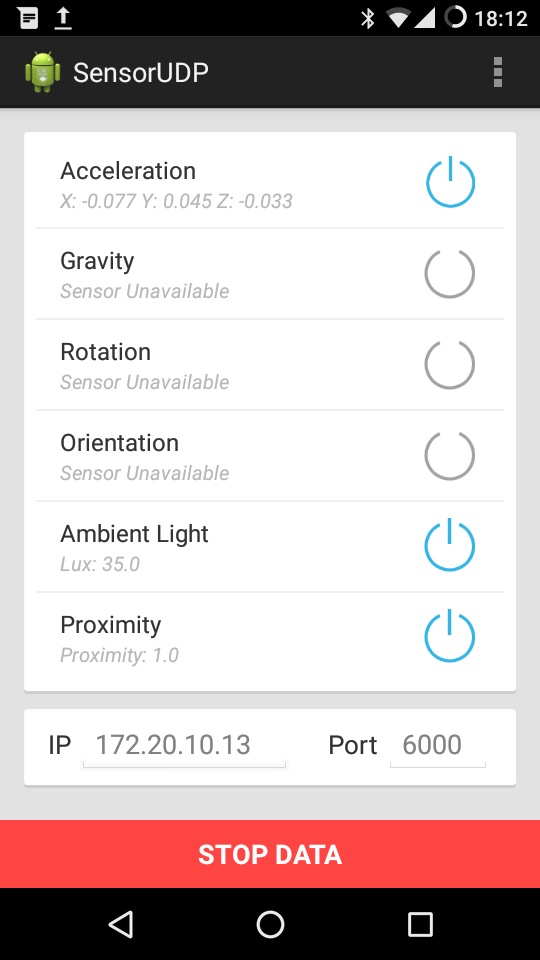

After the smartphone starts sending data, you should see output logs similar to below in your gateway device,

 ```
{'x_acc': -0.003208909183740616, 'y_acc': -0.006447315216064453, 'z_acc': 0.01796436309814453, 'x_gravity': 0.0, 'y_gravity': 0.0, 'z_gravity': 0.0, 'x_rotation': 0.0, 'y_rotation': 0.0, 'z_rotation': 0.0, 'x_orientation': 0.0, 'y_orientation': 0.0, 'z_orientation': 0.0, 'deprecated_1': 0.0, 'deprecated_2': 0.0, 'ambient_light': 56.0, 'proximity': 100.0, 'keyboard_button_pressed': 0.0} ('172.20.10.4', 42048)

{'x_acc': -0.01315280981361866, 'y_acc': 0.034984588623046875, 'z_acc': -0.01422119140625, 'x_gravity': 0.0, 'y_gravity': 0.0, 'z_gravity': 0.0, 'x_rotation': 0.0, 'y_rotation': 0.0, 'z_rotation': 0.0, 'x_orientation': 0.0, 'y_orientation': 0.0, 'z_orientation': 0.0, 'deprecated_1': 0.0, 'deprecated_2': 0.0, 'ambient_light': 56.0, 'proximity': 100.0, 'keyboard_button_pressed': 0.0} ('172.20.10.4', 42048)
 ```

Note: Make sure to connect the smartphone and the gateway device to the same network for this to work. For better security, you can add provisions like SSL, Firewall, and static IP whitelisting.


### 7. Send device events via the gateway

Now that we have the data coming from the device in our gateway, the only task that's left is to publish it to the broker in the cloud. The gateways are allowed to publish events on behalf of devices connected to them. Also, when a privileged gateway publishes an event on behalf of a device for the first time, the IBM IoT cloud platform will register that device. This is known as auto-provisioning of devices. There's also a mechanism to [bulk register devices using REST](https://developer.ibm.com/recipes/tutorials/bulk-register-devices-to-the-ibm-watson-iot-platform-using-rest/) APIs. But since we've just one device, we'll proceed with a former way for now, here's the code,

```python
ANDROID_DEVICE_TYPE = "Android"

def send_android_device_event(client, device_id, eventId, data):
    client.publishDeviceEvent(
      ANDROID_DEVICE_TYPE, device_id, eventId, msgFormat="json", data=data, qos=0)

for data, device_addr in listen_sensor_data():
     send_android_device_event(client, device_addr[0], "status", data)
```

Just like the `client.publishEvent`, there's `client.publishDeviceEvent` to publish device events through gateway clients. In the above snippet, we've used the smartphone's static IP address as the device ID (as that's the unique information we have for now). Ideally, the device ID should be something fixed and unique to identify a particular device. If you go about creating a custom application for the device, you can add the provisions to share meta information like device ID in the data.

After you start publishing the events, the sensor readings should reflect on your platform in real-time like this,


With this, basic infrastructure is set up. Next, we'll see different things that we can try using this infrastructure,

## Exploring different ideas

### Edge computing: Filtering and aggregating data at the edge

You might have noticed that the smartphone streams the sensor data at a quite fast pace, and the data is sent to the cloud broker as is. One nice thing to do would be to send the data to the cloud broker at a slower rate. The following code implements this mechanism using the [timeloop](https://pypi.org/project/timeloop/) library (which internally uses Python's [threading](https://docs.python.org/3/library/threading.html) module).

```python
# File main.py

from datetime import timedelta
import time
from timeloop import Timeloop


client = get_gateway_cilent('gateway_config.yml')
client.connect()
time.sleep(2)
tl = Timeloop()

devices_data = {}


@tl.job(interval=timedelta(seconds=5))
def send_gateway_status():
    send_status_event(client)


@tl.job(interval=timedelta(milliseconds=200))
def send_device_readings():
    for device_addr, data in devices_data.items():
        send_android_device_event(client, device_addr, "status", data)
    devices_data.clear()

tl.start()

for data, device_addr in listen_sensor_data():
    devices_data[device_addr[0]] = data
```

Few things to observe,

- We're publishing the gateway status updates (CPU and memory utilization data) every 5 seconds.
- We're publishing the device data every 200 milliseconds.
- The script will work for multiple devices as well since we're distinguishing devices based on their host address. 

One might be only concerned about eventful changes in sensor readings, so the above logic can further be extended into publishing the data only when there's a substantial change in the values as compared to the previous ones. All these techniques will help ease the computational overhead at the cloud, save network bandwidth, and can be called as Edge computing techniques.

### Visualizations

We can use the IBM IoT platform for visualizing the data being sent to the cloud. Different visualizations of data will help us provide a clearer picture of what has happened. To create visualizations, you can go to your IoT platform dashboard, select to create a new board, and follow the below steps,


- Click **Add new card**.

- Select the card type from the options available. For example, select **Line chart** under **Devices**. 

  

- Select the device that will provide the data to be displayed in the card. Some card types provide an option to use another card as a data source for the data set that is displayed. This allows the data displayed on the dependent card to be filtered by selecting values on the other card, for example, the values that are included in a visualization card can be filtered by selecting which devices to display from a device list card.

- Connect a data set. You'll need to select the event type (status), and then configure a property by selecting the data type and entering a range of values and then clicking **Next**. 

  

- Configure the appearance of the card, by entering size, color, and title for the card, and then click **Submit** to add the card to the board. 

I played around with different visualizations to create the following board,


### Sending commands

The infrastructure that we've set up so far transmits the data only in one direction (from device to gateway to the cloud). But what if we want to send the data in another direction? What if we want to send instructions to the device to act in a certain way? This can be done through commands. Commands are nothing but MQTT messages that are sent from the cloud/application layer back to the lower layers. 

The wiotp-sdk provides an abstraction for application clients with functionalities to send commands to the devices or gateways. The following code snippet walks through one such use-case implementation,

```python
# File application.py

import wiotp.sdk.application

options = config = wiotp.sdk.application.parseConfigFile("app_config.yml")
app_client = wiotp.sdk.application.ApplicationClient(options)

app_client.connect()

def send_reset_command(client, type, id):
  data = {'reset': True}
  client.publishCommand(type, id, "reset", "json", data)
  
send_reset_command(app_client, 'raspi', 'raspi-1')
```

This application connects directly to the cloud and resides at a different location than the gateway. The simple command we send to the gateway here is instructing it to reset (clear all the data it has). Of course, this is a naive use-case, but you can extend it to do something more useful like restarting the device, changing the rate at which data is sent, etc.

Just like the gateway config, you can specify the application config in a YAML file, which should be similar to the one below,

```yaml
# app_config.yml
identity:
    appId: any_app_id
auth:
    key: your_key
    token: your_token
options:
    domain: internetofthings.ibmcloud.com
    logLevel: debug
```

The key and the token for the application can be generated by clicking the **Generate API Key** button in the Apps section of your IoT Dashboard. I've assigned the role to be Backend Trusted application. 


Add the key and the auth token you get on the next screen to your application_config.yml file. 

The above implementation suffices for the application side, but what about the gateway? How should the gateway handle the command? For that, we need to add the following logic at our gateway,

```python
# main.py

def gateway_command_callback(cmd):
    print("Command received for {}:{}: {}".format(cmd.typeId, cmd.deviceId, cmd.data))
    if cmd.typeId == 'reset':
      devices_data = {}
    else:
      print("Unknow command type received")

# Subscribing to commands
gateway_client.subscribeToCommands(self, commandId="reset"):
# Registering a callback 
gateway_client.commandCallback = gateway_command_callback
```

Above, we've registered a callback function that gets fired every time the gateway client receives a command. The command can then be handled based on its ID and the data being sent. In a similar manner as discussed above, commands can also be sent to the devices.

### Device management

A complex IoT system might contain many devices, so it is helpful to include device management capabilities in the architecture. IoT devices are often deployed in hostile environments. They need to be monitored actively, and when they fail, they might need to be retired or updated so that they can continue to operate in those environments. Device management capabilities allow IoT developers to control IoT devices by performing operations like resetting them to factory defaults or applying updates to patch security issues or fix bugs.

You can use the IBM Watson IoT Platform device management protocol to configure your IoT devices as [managed devices](https://cloud.ibm.com/docs/services/IoT/devices/device_mgmt/index.html#index) (we've so far been working with unmanaged devices), which allows the devices to be rebooted, to be reset to factory defaults, or for firmware to be downloaded or upgraded remotely. Managed devices implement the [Device Management Protocol](https://cloud.ibm.com/docs/services/IoT/devices/device_mgmt/index.html), which is built on MQTT. The wiotp-sdk also provides separate clients for [Managed devices](https://ibm-watson-iot.github.io/iot-python/device/managed/) and [Managed gateways](https://ibm-watson-iot.github.io/iot-python/gateway/managed/) for convenience (i.e., we can simply use `wiotp.sdk.gateway.ManagedGatewayClient` instead of `wiotp.sdk.gateway.GatewayClient`) which will allow you to trigger device management actions through the IBM cloud IoT dashboard. Just like command handling, you'll need to set up callbacks to handle the device management actions.

After registering a managed device, the Device Actions section on the device detail page in the Watson IoT Platform dashboard is automatically updated to include buttons that can be used to trigger these device actions.

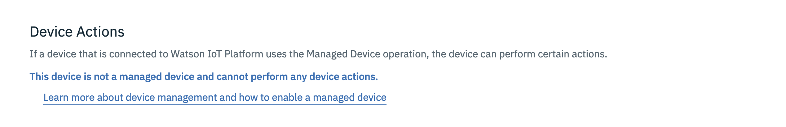

For a Managed device,


Also, a log of device actions that have been applied is available under the Action tab on the Devices page in the dashboard, and the  Initiate Action button on this page can also be used here to trigger actions. These actions can be applied to a single device or all devices of a given type at the same time.


### Storing data in a database

We can store the events in a [Cloudant](https://www.ibm.com/cloud/cloudant) NoSQL database for persistence and later analysis. To do that, we need to create a Cloudant DB  service by choosing **Cloudant NoSQL DB** from the IBM Cloud Catalog. Enter a name for the Cloudant service, select a region and plan and then press the ‘Create’ button. 


It might take some time to provision. We then need to get to the service dashboard and generate Service credentials that'll be used in the application. 


Once we have the credentials, we can create bind the application client to the Cloudant service and configure connector, destination, and rules to send the events to the cloudant database. Following is the code for that,

```python
# Service Credentials From the Cloudant DB dashboard
cloudant_creds = {
  "apikey": "your_api_key_here",
  "host": "7fe82452-66d6-460b-afd6-69bf8f4bc8e-bluemix.cloudantnosqldb.appdomain.cloud",
  "password": "pwd_here",
  "port": 443,
  "username": "username_here"
}

service_binding = {
    "name": "any-binding-name",
    "description": "Test Cloudant Binding",
    "type": "cloudant",
    "credentials": cloudant_creds
}

# Bind application to the cloudant DB
cloudant_service = app_client.serviceBindings.create(service_binding)

# Create the connector
connector = app_client.dsc.create(
    name="connector_1", type="cloudant", serviceId=cloudant_service.id, timezone="UTC",
    description="Data connector", enabled=True
)

# Create a destination under the connector
destination_1 = connector.destinations.create(name="sensor-data", bucketInterval="DAY")

# Create a rule under the connector, that routes all Android status events to the destination
rule_1 = connector.rules.createEventRule(
    name="status_events", destinationName=destination_1.name, typeId="Android", eventId="status",
    description="Send android status events", enabled=True
)

# Create another destination under the connector
destination_2 = connector.destinations.create(name="gateway-data", bucketInterval="DAY")

# Create a rule under the connector, that routes all raspi status events to the destination
rule_2 = connector.rules.createEventRule(
    name="status_events", destinationName=destination_2.name, typeId="raspi", eventId="status",
    description="Gateway status events", enabled=True
)
```

You can read in detail about bindings, connectors, destination, and rules [here](https://www.ibm.com/support/knowledgecenter/SSQP8H/iot/platform/reference/dsc/index.html). In brief, what we did above was configured our application with the cloudant service in such a way that all the 'Android' status events go to a separate historian database, and all the 'raspi' status events to another historian database, both of which are bucket by the interval of a day. 

If you go to the Cloudant service dashboard after setting up these rules through the wiotp-sdk, you'll see a few generated databases like this,


And they'll contain all your events data in the form of documents, 

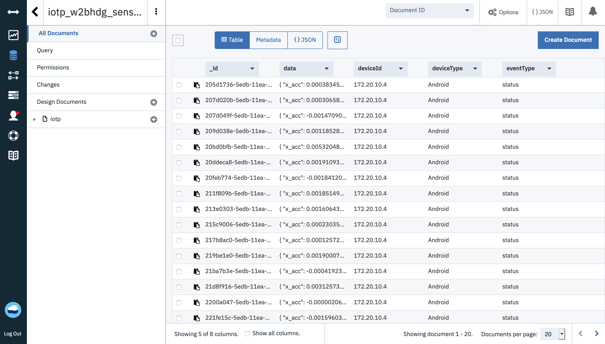


### Use the data for advanced analytics

The data saved into Cloudant can be used for advanced analytics. Let's see an example of how we can fetch this data in a Jupyter Notebook available in [Watson Studio](https://www.ibm.com/cloud/watson-studio), and write custom analytics techniques. Following are the steps to do that,

1. Go to the [**IBM Cloud Catalog**](https://cloud.ibm.com/catalog/) and under **AI**, select [**Watson™ Studio**](https://cloud.ibm.com/catalog/services/data-science-experience).
2. Create the service. Select a region and choose **Lite** pricing plan. Enter a **Service name** and select a resource group.
3. Launch the dashboard by clicking **Get Started** and click **Create project** > Create an empty project and enter some name for the project.
4. Create a new cloud storage service (Select **Lite** plan > Create). Hit **Refresh** to see the created service.
5. Click **Create**. Your new project opens, and you can start adding resources to by clicking **Add to project** button.


6. We'll select Notebook, and there are other resources too that you can explore. Enter some name and description and select appropriate runtime. Watson Studio supports both Python and R environments. It also has support for Spark and Scala. Let's choose Spark with Python environment.


7. To use our cloudant data, we need to add a connection resource to the project. To do that, go to the project page of Watson studio, click on **Add to project** again, and choose **Connection** asset this time, select your Cloudant service, and click on **Create**.

   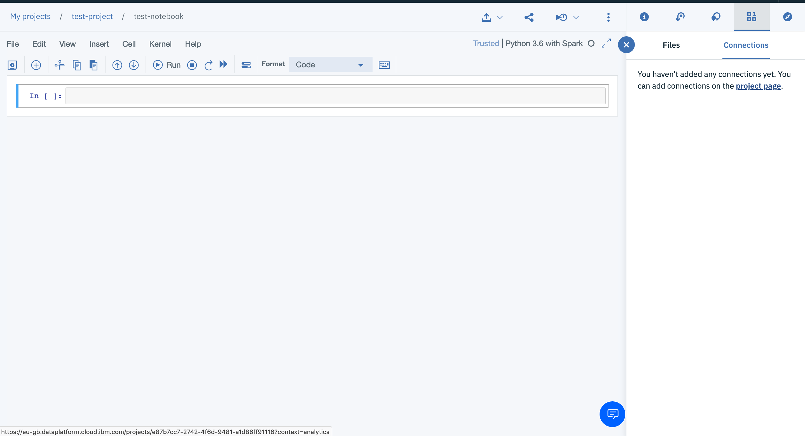

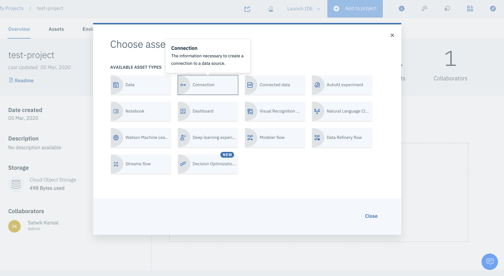


9. Now in your notebook, you'll be able to see the cloudant service, click on credentials to insert them in a cell.


Run the following code in the notebook, 

```python
!pip install --upgrade pixiedust
import pixiedust

username = credentials_1["username"]
password = credentials_1["password"]
host = username + '.cloudantnosqldb.appdomain.cloud'
dbName = 'iotp_65cjsf_sensor-data_2020-03-03' # DB name, can be found on the cloudant service

pixiedust.installPackage("cloudant-labs:spark-cloudant:2.0.0-s_2.11")


cloudantdata = sqlContext.read.format("com.cloudant.spark").\
option("cloudant.host", host).\
option("cloudant.username", username).\
option("cloudant.password", password).\
load(dbName)

cloudantdata.show()
```

Now we have all the Android events data available as a PySpark dataframe object, which we can use for analysis and visualization via PySpark and Python.


### Other things to try

**Device Simulations:** Just in case you don't have the device or want to simulate specific scenarios, you can use the Simulation feature provided by the IBM IoT platform. Go to the settings page from the IoT platform, and select **Activate Device Simulator**. After that, you can follow [this documentation](https://www.ibm.com/support/knowledgecenter/SSQP8H/iot/platform/reference/dashboard/device_sim.html) to know specifics of how to simulate various scenarios.

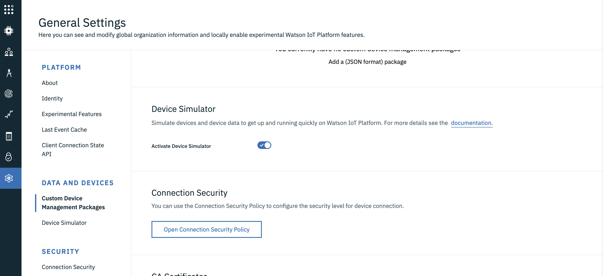

**Device interfaces and Notifications:** If you want to monitor the events data and to trigger an action when a certain condition is met, you can set up a Logical device interface and notification rules. Once set up, you can subscribe to these MQTT notification topics in your application and take appropriate actions when they're triggered. [This article](https://www.ibm.com/support/knowledgecenter/SSQP8H/iot/platform/reference/embeddedrules/index.html) covers how to implement it in detail. 

**Create your own web-interface:** We used our application script to create connectors and publish device commands. We used the platform to visualize the data and send actions. But all this functionality can also be provided via a higher-level web interface. The application client can subscribe to Device events to get the data, can publish commands, so there's a lot of scope to implement things from scratch. The web interface you develop can be deployed to IBM Cloud using [Cloud Foundry](https://www.ibm.com/cloud/cloud-foundry) service. 

 And here are some ideas to extend our present naive door monitoring system so far, 

- Use the proximity sensor to trigger some events (Like greeting sound, turning on other devices connected to the gateway, and so on).
- Monitor accelerometer readings, use some anomaly detection techniques to figure out how many times the door is opened throughout the day and other statistics.
- Create your custom application and record other things like noise levels. Or maybe use discrete hardware sensors like temperature, humidity, light, etc. You can add a button in the application or a hardware buzzer that can serve as your doorbell.
- Do some actions based on the light intensity, like turning on some light (connected to the network) when the intensity falls below a threshold.

## Conclusion

In this post, we discussed various components of a typical IoT architecture. Though IoT is a vast topic and its use-cases spread across multiple domains, the knowledge of different concepts we discussed will enable you to get going with most of the use-cases using IBM Cloud.